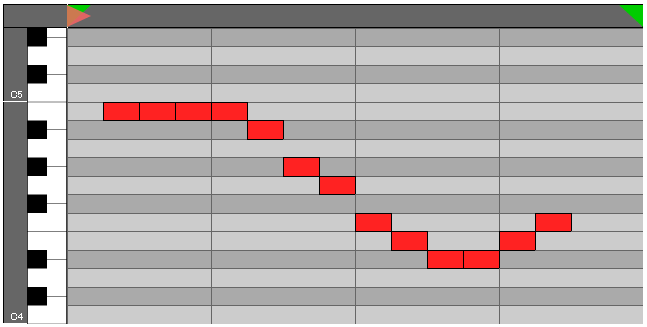
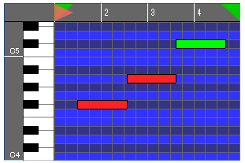

# WebAudio-Pianoroll

**WebAudio-Pianoroll** is a graphical user interface (GUI) library designed for displaying piano rolls, like those commonly found in music applications.

* **Edit Modes:** WebAudio-Pianoroll offers four edit modes: `gridmono`, `gridpoly`, `dragmono`, and `dragpoly`. The `grid` types toggle grid cells by clicking, with a fixed note length of 1 tick, suitable for rhythm machine-like applications. On the other hand, the `drag` types allow for specifying note length by dragging, matching the functionality of generic pianoroll apps.
* **Customization:** The library provides numerous customization options.
* **Playback Support:** Although WebAudio-Pianoroll doesn't directly generate sound, it includes playback support functionality.

A live demo page is available.

### [Live Demo: 'gridmono' mode](https://g200kg.github.io/webaudio-pianoroll/)
### [Live Demo: 'dragpoly' timebase=480 mode](https://g200kg.github.io/webaudio-pianoroll/index3.html)

----

## Usage

* #### Installing WebAudio-Pianoroll  

Deploy the `webaudio-pianoroll.js` file appropriately. The only necessary file is `webaudio-pianoroll.js`.

Load the `webaudio-pianoroll.js` file:
  ``
  
  Or, directory load from GitHub pages as CDN.  
  ``

* #### If needed, load webcomponents.js into your HTML:  
``  

* #### Place the WebAudio-PianoRoll element into your HTML:
 `<webaudio-pianoroll></webaudio-pianoroll>`  

The default configuration of the element looks like this:  
  

  You can now customize the pianoroll through its attributes. For example:  
 `<webaudio-pianoroll width="300" height="200" xrange="64" markend="64" collt="#33f" coldk="#338" editmode="dragmono"></webaudio-pianoroll>` 

   

## Usage

#### Grid Mode
* Grid cells can be toggled on/off by clicking.
* When dragging, multiple cells can be toggled on or off based on the state of the first cell.

#### Drag mode
* Left-click and drag to create a note of specified length.
* Click an existing note to select it.
* Right-click and drag to select notes within a specified area (inclusion based on whether the beginning of the note is within the range).
* Selected notes can be moved by left-click dragging.
* Drag the left or right edge of a selected note to change its length.
* Right-click on a selected note for deletion options.

#### Common
* The time axis can be zoomed using the mouse wheel if enabled by the "wheelzoom" attribute.

## Attributes
All of these attributes can be changed to customise the appearance and functionality of the piano roll. Changes may require redraw().

|Attribute     |Type   |Default Value   |Description               |
|--------------|-------|----------|--------------------------|
|**width**     |Number |640       | The Element's width, in pixels   |
|**height**    |Number |320       | The Element's height, in pixels  |
|**editmode**  |String |"gridmono"| The Method of operation the element uses. Set with a combination of "grid"/"drag" + "mono"/"poly"|
|**timebase**  |Number |16        | The time resolution of 1 bar,  (1 bar / timebase = 1 tick)  |
|**xrange**    |Number |16        | The range of the time axis, in ticks|
|**yrange**    |Number |16        | The range of the pitch axis, in notes |
|**xoffset**   |Number |0         | The time axis offset, in ticks|
|**yoffset**   |Number |60        | The pitch axis offset, in note number|
|**xscroll**   |Number |0         | Allows for time-axis scrolling if set to 1|
|**yscroll**   |Number |0         | Allows for pitch-axis scrolling if set to 0|
|**grid**      |Number |4         | The time axis grid density, in ticks|
|**snap**      |Number |1         | The time-snapping resolution of notes, tick|
|**wheelzoom** |Number |0         | if non 0, time axis zoom by wheel is enabled|
|**xruler**    |Number |24        | The time-axis ruler height in pixels|
|**yruler**    |Number |24        | The ptich-axis ruler width in pixels|
|**octadj**    |Number |-1        | ruler octave value adjust  (-1 : 60=C4)|
|**cursor**    |Number |0         | The current position of the player head, in ticks|
|**markstart** |Number |0         | The start marker's position, in ticks|
|**markend**   |Number |16        | The end marker's position, in ticks|
|**collt**     |String |"#ccc"    | The Piano Roll's background (light part) colour|
|**coldk**     |String |"#aaa"    | The Piano Roll's background (dark part) colour|
|**colgrid**   |String |"#666"    | The Colour of the Piano Roll's Grid|
|**colnote**   |String |"#f22"    | The Colour of Notes |
|**colnotesel**|String |"#0f0"    | The Colour of the selected note (for the "drag" edit mode)|
|**colnoteborder**|String|"#000" | The colour of note borders.|
|**colrulerbg**|String |"#666"    | The background color of the axis rulers|
|**colrulerfg**|String |"#fff"    | The colour of the text on the axis rules|
|**colrulerborder**|String|"#000"| The colour of the borders on the axis rulers |
|**bgsrc**     |String|null| The background image url. (Requires collt/coldk to be transparent using rbga())|
|**cursorsrc** |String | internal resource| The image url used for the player head|
|**cursoroffset**|Number|0|The x-offset for the player head in pixels|
|**markstartsrc**|String|internal resource| The image url used for the start marker|
|**markstartoffset**|Number|0| The x-offset for the start marker in pixels|
|**markendsrc**|String|internal resource| The image url used for the end marker|
|**markendoffset**|Number|-24| The x-offset for the end marker in pixels|
|**kbsrc**     |String|internal resource| The url used for the keyboard's image|
|**kbwidth**   |Number|40| The width to display the keyboard image.|
|**loop**      |Number |1         | Allows for looping if set to 1|
|**preload**   |Number |1| The number of seconds of data to be pre-loaded|
|**tempo**     |Number|120|The Tempo to play the music at|

## Functions

|Function|Description|
|--------|-----------|
|**redraw()**| redraws the Piano Roll|
|**getMMLString()**| gets the MML string representation of the piano roll's current data.   (only compatible with `mono` edit modes)|
|**setMMLString(str)**| sets the piano roll's notes using an MML string.  (only compatible with `mono` edit modes)|
|**locate(tick)**| sets the cursor to a specified tick|
|**play(audioContext, callback, starttick)**|begins playback of the inputted melody. Note: `webaudio-pianoroll` does not generate sound directly, but can pass note events to a specified callback function as they occurr. `audioContext` is used to control the time axis. If `starttick` is not specified, playback begins from the cursor's current position.|
|**stop()**|stops playback.|

## Callback
As stated above, the play() function passes data from the piano roll to a callback function, in the form of events. Example usage of this can be seen below:
`callback({t:noteOnTime, g:noteOffTime, n:noteNumber})`

Here, the noteOnTime and noteOffTime is audioContext timeline value, with noteNumber representing the pitch of the note being played.

## Internal Data Structure
If you would prefer to directly access the piano roll's sequence data, you can get it from the element's `sequence` attribute.
This will give an array of Events, where Events are an object consisting of:
`{t:noteOnTick g:noteLength n:noteNumber}`

## License
`webaudio-pianoroll` is licensed under the Apache License, Version 2.0
